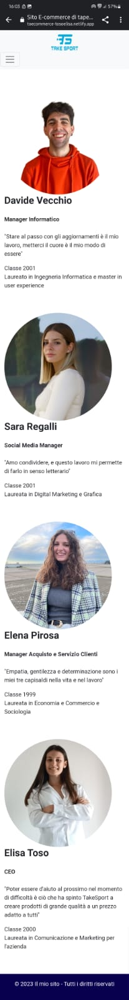
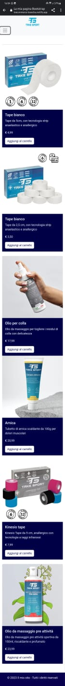
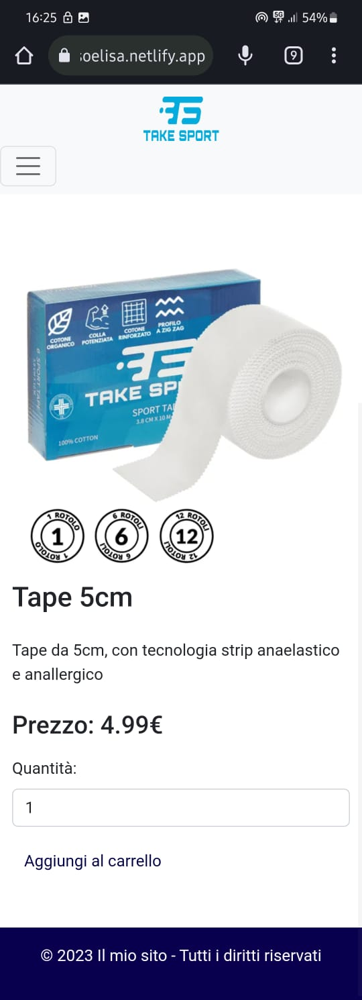
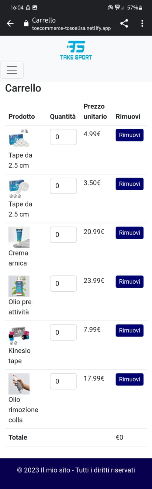
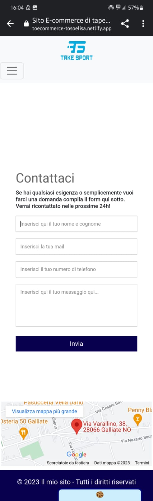

# E-commerce TAKE SPORT
## Progetto d'esame Web Design 2
# Professore M. Baccan
Anno accademico 2022/2023

<!-- _paginate: false -->
<!-- style: "
img[alt~='center'] {
  display: block;
  margin: 0 auto;
}
" -->

---

# Indice

- Introduzione
- Sito Web
- GitHub
- Netlify
- Chat GPT
- Bootstrap
- Responsive
- GTMetrix

---

## Introduzione

Durante il corso abbiamo avuto l'occasione di sviluppare e creare un nostro sito di e-commerce, utilizando una combinazione di codici HTML, CSS e JavaScript. Questa esperienza ci ha permeso di mettere in pratica le nostre competenze acquisite nel corso e di creare un sito web personalizzato al 100% che fosse funzionale e al tempo stesso accattivante per il cliente.
Abbiamo scelto il nostro argomento in totale libertà, in modo che fosse in linea con i nostri interessi e le nostre passioni, creando così un sito di e-commerce reale e funzionante.
Abbiamo anche avuto la possibilità di aggiungere delle funzionalità interattive utilizzando JavaScript, consentendo agli utenti di interagire con il sito in modo dinamico e intuitivo.

---

## TAKE SPORT

Nel mio caso ho scelto un sito di **e-commerce specializzato** in prodotti medici per gli atleti. Questa idea mi è nata dal fatto che quando abbiamo dovuto scegliere l'argomento ho scoperto che questa azienda, la **TakeSport**, mi avrebbe sponsorizzata come atleta. Ho quindi deciso di unire qualcosa che conosco molto bene con qualcosa di già esistente, creando una pagina a mio gusto ma con i prodotti e il logo di TakeSport. In questo sito i clienti potranno esplorare e acquistare tutti i prodotti, o quasi, creati fino ad ora dall'azienda. L'**obiettivo** principale è fornire ai clienti un'esperienza completa nel mondo del taping sportivo e molto altro. Il tutto attraverso un sito semplice ed intuitivo, che permetterà ai clienti di trovare il prodotto più adatto a loro.

---

# Sito Web
**Pagina Home**
Come prima pagina all'apertura del sito comparirà la pagina Home. In alto troviamo il banner con il logo e il menù del sito. Spostando lo sguardo un pochino più in basso invece troveremo una breve presentazione di cosa è TakeSport con accanto un video tutorial su uno dei loro prodotti (l'idea era di mettere un video di presentazione ma non esiste). Andando ancora più in basso troveremo uno slider con tutti i prodotti venduti, dove cliccando su qualsiasi di essi verremo riportati alla pagina di quello specifico prodotto. Infine potremo trovare un footer con alcuni dati tecnici e un banner a comparsa con un biscotto, che ci consentirà di accettare o meno l'utilizzo dei cookies da parte del sito. Una volta cliccato accetta o rifiuta questo banner scomparirà.

---

## Struttura

---

## Pagina Team
All'interno della pagina "Team" viene mostrato chi è il team che c'è dietro a TakeSport. Sono presentati i quattro componenti principali che gestiscono l'azienda. Ho messo le foto abbinate ai nomi, la mansione all'interno dell'organigramma, l'età e una frase significativa per loro. Le frasi sono state realizzate grazie al supporto di un ormai famoso sito di intelligenza artificiale chiamato ChatGPT.

---

### Struttura

---

## Pagina Prodotti
All'interno della pagina prodotti si trovano, oltre ai soliti componenti ripetuti all'interno di tutte le pagine, possiamo trovare una vasta gamma di prodotti tra cui il cliente può scegliere di selezionarne uno. Infatti cliccando su uno qualsiasi di questi si aprirà la pagina del singolo prodotto.

---

### Struttura

---

## Pagina Prodotto Singolo
Una volta cliccato sul prodotto nella pagina prodotti o sullo slider presente nella homepage, il cliente verrà riportato alla pagina del singolo prodotto, al cui interno si potrà trovare il prezzo, una breve descrizione e la possibilità di aggiungere il prodotto al carrello. In questo caso il sito porterà il cliente nella pagina del carrello.

---

### Struttura

---

## Pagina Carrello
Una volta scelto il prodotto di acquistare si arriva poi alla pagina del carrello in cui si potranno trovare tutti i prodotti con la possibilità di scegliere la quantità del singolo prodotto, di eliminarlo o di procedere all'acquisto.

---

### Struttura

---

## Pagina Contatti
All'interno della pagina contatti il cliente avrà la possibilità di contattare il nostro team e di visualizzare la posizione della sede. Per contattare l'azienda il cliente pdovrà semplicemente compilare il form inserendo i dati e cliccando il bottone di invio del modulo.

---

### Struttura

---

# GitHub
GitHub è una piattaforma di hosting per il software. È ampiamente adottata nella comunità dello sviluppo software per gestire la versione del codice, coordinare il lavoro tra team di sviluppatori e condividere progetti open source.
Nel mio caso, ho utilizzato GitHub per stabilire tutti i collegamenti con le immagini archiviate in locale e successivamente caricate sulla stessa piattaforma. In questo modo, ho sempre avuto un controllo completo sulla situazione relativa al risultato finale attraverso il collegamento tra GitHub e Netlify.
Inoltre, tra i vari documenti di testo, ho incluso anche file CSS e JavaScript che, attraverso le linee di codice, si collegano alle rispettive pagine HTML.

---

# Netlify

---

# Chat GPT

---

# Bootstrap

---

# Responsive
## Home

---

# Responsive
## Team

---

# Responsive
## Prodotti

---

# Responsive
## Prodotto

---

# Responsive
## Carrello

---

# Responsive
## Contatti

---

# GTMetrix

--
# Grazie per l'attenzione
## Progetto d'esaame Web Design 2
### A cura di Elisa Toso

Immagine d'impresa e strategie di comunicazione
A.A. 2022 - 2023
