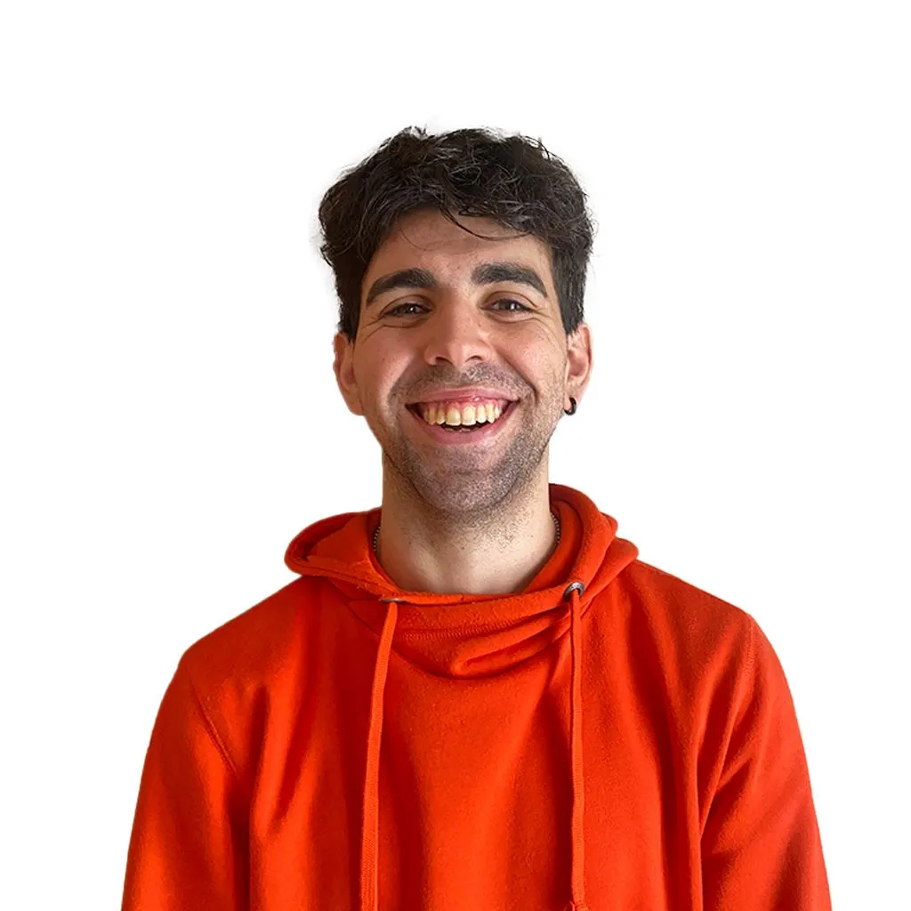

# E-commerce TAKE SPORT
## Progetto d'esame Web Design 2
# Professore M. Baccan
Anno accademico 2022/2023

<!-- _paginate: false -->
<!-- _footer: "" -->
<!-- style: "
img[alt~='center'] {
  display: block;
  margin: 0 auto;
}
" -->

---

# Indice

- Introduzione
- Sito Web
- GitHub
- Netlify
- Chat GPT
- Bootstrap
- Responsive
- GTMetrix

---

## Introduzione

Durante il corso abbiamo avuto l'occasione di sviluppare e creare un nostro sito di e-commerce, utilizando una combinazione di codici HTML, CSS e JavaScript. Questa esperienza ci ha permeso di mettere in pratica le nostre competenze acquisite nel corso e di creare un sito web personalizzato al 100% che fosse funzionale e al tempo stesso accattivante per il cliente.
Abbiamo scelto il nostro argomento in totale libertà, in modo che fosse in linea con i nostri interessi e le nostre passioni, creando così un sito di e-commerce reale e funzionante.
Abbiamo anche avuto la possibilità di aggiungere delle funzionalità interattive utilizzando JavaScript, consentendo agli utenti di interagire con il sito in modo dinamico e intuitivo.

---

## TAKE SPORT

---

# Sito Web
## Pagina Home

---

## Struttura

---

## Pagina Team

---

### Struttura

---

## Pagina Prodotti

---

### Struttura

---

## Pagina Prodotto Singolo

---

### Struttura

---

## Pagina Carrello

---

### Struttura

---

## Pagina Contatti

---

### Struttura

---

# GitHub

---

# Netlify

---

# Chat GPT

---

# Bootstrap

---

# Responsive
## Home

---

# Responsive
## Team

---

# Responsive
## Prodotti

---

# Responsive
## Prodotto

---

# Responsive
## Carrello

---

# Responsive
## Contatti

---

# GTMetrix

--
# Grazie per l'attenzione
## Progetto d'esaame Web Design 2
### A cura di Elisa Toso

Immagine d'impresa e strategie di comunicazione
A.A. 2022 - 2023
