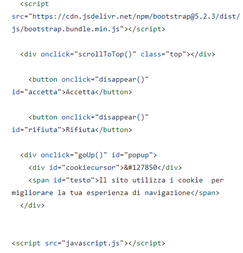
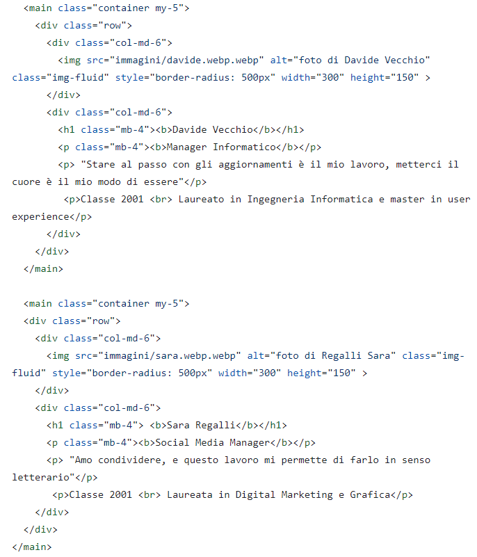
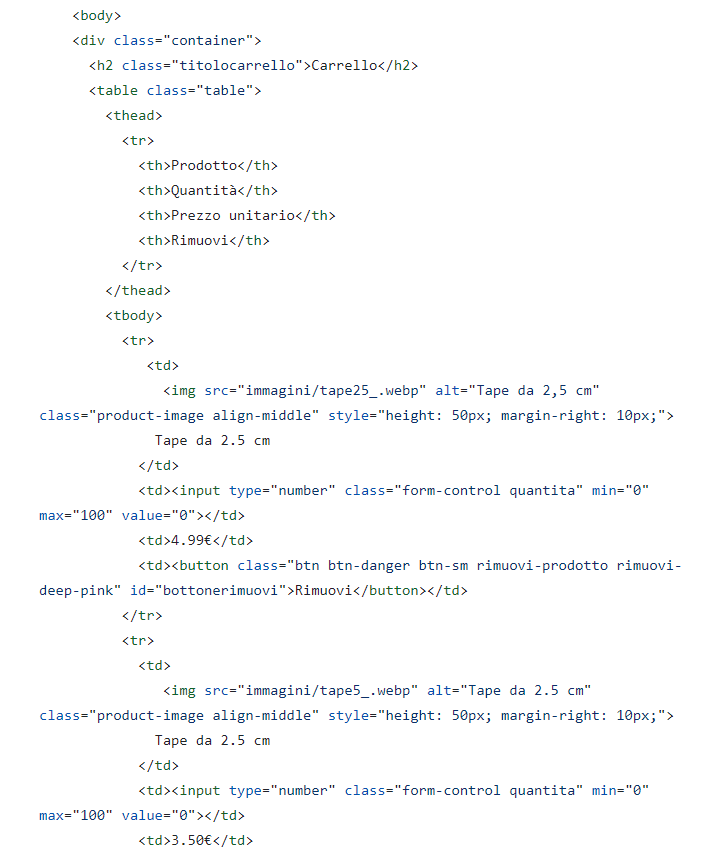

# E-commerce TAKE SPORT
## Progetto d'esame Web Design 2
## Professore M. Baccan
### Anno accademico 2022/2023
### Elisa Toso, matricola 809

<!-- _paginate: false -->
<!-- style: "
img[alt~='center'] {
  display: block;
  margin: 0 auto;
}
" -->

---

# Indice

- Introduzione
- Sito Web
- GitHub
- Netlify
- Chat GPT
- Bootstrap
- Responsive
- GTMetrix

---

## Introduzione

Durante il corso abbiamo avuto l'occasione di sviluppare e creare un nostro sito di e-commerce, utilizando una combinazione di codici HTML, CSS e JavaScript. Questa esperienza ci ha permeso di mettere in pratica le nostre competenze acquisite nel corso e di creare un sito web personalizzato al 100% che fosse funzionale e al tempo stesso accattivante per il cliente.
Abbiamo scelto il nostro argomento in totale libertà, in modo che fosse in linea con i nostri interessi e le nostre passioni, creando così un sito di e-commerce reale e funzionante.
Abbiamo anche avuto la possibilità di aggiungere delle funzionalità interattive utilizzando JavaScript, consentendo agli utenti di interagire con il sito in modo dinamico e intuitivo.

---

## TAKE SPORT

Nel mio caso ho scelto un sito di **e-commerce specializzato** in prodotti medici per gli atleti. Questa idea mi è nata dal fatto che quando abbiamo dovuto scegliere l'argomento ho scoperto che questa azienda, la **TakeSport**, mi avrebbe sponsorizzata come atleta. Ho quindi deciso di unire qualcosa che conosco molto bene con qualcosa di già esistente, creando una pagina a mio gusto ma con i prodotti e il logo di TakeSport. In questo sito i clienti potranno esplorare e acquistare tutti i prodotti, o quasi, creati fino ad ora dall'azienda. L'**obiettivo** principale è fornire ai clienti un'esperienza completa nel mondo del taping sportivo e molto altro. Il tutto attraverso un sito semplice ed intuitivo, che permetterà ai clienti di trovare il prodotto più adatto a loro.

---

# Sito Web
**Pagina Home**
Come prima pagina all'apertura del sito comparirà la pagina Home. In alto troviamo il banner con il logo e il menù del sito. Spostando lo sguardo un pochino più in basso invece troveremo una breve presentazione di cosa è TakeSport con accanto un video tutorial su uno dei loro prodotti (l'idea era di mettere un video di presentazione ma non esiste). Andando ancora più in basso troveremo uno slider con tutti i prodotti venduti, dove cliccando su qualsiasi di essi verremo riportati alla pagina di quello specifico prodotto. Infine potremo trovare un footer con alcuni dati tecnici e un banner a comparsa con un biscotto, che ci consentirà di accettare o meno l'utilizzo dei cookies da parte del sito. Una volta cliccato accetta o rifiuta questo banner scomparirà.

---

### Struttura
HTML, Hyper Text Markup Language, è un linguaggio di markup nato per la formattazione e impaginazione di documenti ipertestuali disponibili nel web. All'interno di esso sono andata a definire il font utilizzato (in questo caso il Century Gothic), a sviluppare la parte della navbar, che comprende il logo con le relative misure e margini e gli elementi comprendenti i collegamenti ipertestuali alle altre pagine collegate. Sono andata poi a inserire in ogni pagina delle righe di codice costanti come quelle legate al relativo collegamento con il CSS e a JavaScript dei Cookies.

---

Per prima cosa, sono andata a creare due colonne, attraverso cui ho inserito in quella di sinistra un video di YouTube, mentre in quella di destra ho inserito del testo, andando a separare ogni tanto i paragrafi per rendere più chiaro e visivamente piacevole il testo. Poi ho inserito delle stringhe di testo relative allo slider, creando dei collegamenti in modo che nel momento in cui il cliente voglia andare ad informarsi di più su uno dei prodotti che vede lo possa fare cliccandoci sopra. Per concludere all'interno del footer ho voluto inserire qualche dato riguardante l'azienda.

---

Qui invece troviamo tutta la parte legata a JavaScript, un codice che permette di creare effetti dimanici interattivi tramite funzioni di script invocate da eventi innescati dall'utente sulla pagina in uso, come ad esempio il click del mouse. Ad esempio nel mio sito ho usato JavaScript per la tendina dei Cookies. Al click la tendina si alza e mostra la richiesta di accettare o rifiutare le condizioni. Al click su accetta o rifiuta la tendina scomparirà e non ricomparirà a meno che non si ricarichi la pagina.

---

Inoltre ho utilizzato anche il CSS per personalizzare al massimo il mio sito. Ad esempio l'ho utilizzato per lo slider, per i colori, i font e per la tendina dei cookies.

---

## Pagina Team
All'interno della pagina "Team" viene mostrato chi è il team che c'è dietro a TakeSport. Sono presentati i quattro componenti principali che gestiscono l'azienda. Ho messo le foto abbinate ai nomi, la mansione all'interno dell'organigramma, l'età e una frase significativa per loro. Le frasi sono state realizzate grazie al supporto di un ormai famoso sito di intelligenza artificiale chiamato ChatGPT.

---

### Struttura
La pagina del TEAM a livello di programmazione è molto semplice. Ho utilizzato due colonne: nella prima ho inserito le foto dei componenti del team aziendale, con un raggio del bordo che mi permettesse di ottenere un cerchio, mentre nella colonna di destra ho inserito le informazioni relative ad ogni componente del gruppo.
Come in tutte le altre pagine ho mantenuto sia il footer che la barra di navigazione.

---

## Pagina Prodotti
All'interno della pagina prodotti si trovano, oltre ai soliti componenti ripetuti all'interno di tutte le pagine, possiamo trovare una vasta gamma di prodotti tra cui il cliente può scegliere di selezionarne uno. Infatti cliccando su uno qualsiasi di questi si aprirà la pagina del singolo prodotto.

---

### Struttura
La pagina contiene, una serie di stringhe di testo che si ripetono per ogni prodotto, in cui troviamo una class che va a contenere all'interno di uno specifico riquadro un'immagine, che è anche un collegamento ipertestuale alla pagina del prodotto specifico, e la relativa descrizione al di sotto. 
Come in tutte le altre pagine ho mantenuto sia il footer che la barra di navigazione.

---

## Pagina Prodotto Singolo
Una volta cliccato sul prodotto nella pagina prodotti o sullo slider presente nella homepage, il cliente verrà riportato alla pagina del singolo prodotto, al cui interno si potrà trovare il prezzo, una breve descrizione e la possibilità di aggiungere il prodotto al carrello. In questo caso il sito porterà il cliente nella pagina del carrello.

---

### Struttura
All'interno della pagina in cui vengono visualizzati i prodotti specifici troviamo diverse class in cui viene definita l'immagine, la descrizione del prodotto e la quantità che con degli option selected permettono al cliente di selezionare quella desiderata. C'è poi sotto un tasto che consente di aggiungere al carrello il prodotto selezionato, realizzato con bootstrap e modificato in css. La parte di css del tasto realizzato tramite bootstrap è con lo stesso stile di tutti i successivi.
Come in tutte le altre pagine ho mantenuto sia il footer che la barra di navigazione.

---

## Pagina Carrello
Una volta scelto il prodotto di acquistare si arriva poi alla pagina del carrello in cui si potranno trovare tutti i prodotti con la possibilità di scegliere la quantità del singolo prodotto, di eliminarlo o di procedere all'acquisto.

---

### Struttura
All'interno della pagina del carrello troviamo una tabella con i titoli scritti come prima riga, per poipassare alla seconda riga di contenuto dove sono andata a raggrupparli all'interno di una classe per fare sì che si allineassero tutti al centro di essa, definendo poi i vari margini. Una volta chiusa la tabella sono andato ad inserire una stringa di testo che indichi il risultato finale del calcolo, inserendo poi un altro tasto bootstrap per completare l'acquisto o per rimuovere tutti gli articoli del carrello.

---

## Pagina Contatti
All'interno della pagina contatti il cliente avrà la possibilità di contattare il nostro team e di visualizzare la posizione della sede. Per contattare l'azienda il cliente pdovrà semplicemente compilare il form inserendo i dati e cliccando il bottone di invio del modulo.

---

### Struttura
La prima cosa che si nota è una seire di box contenenti delle stringhe di testo di input, all'interno delle quali bisogna andare ad inserire determinati valori numerici o testuali. Una volta completata la compilazione si potrà procedere all'invio tramite l'apposito tasto. Subito sotto questo form di compilazione si trova una mappa contenente una finta sede, il tutto gestito a livello grafico e di dimensione all'interno della pagina css.

---

# GitHub
GitHub è una piattaforma di hosting per il software. È ampiamente adottata nella comunità dello sviluppo software per gestire la versione del codice, coordinare il lavoro tra team di sviluppatori e condividere progetti open source.
Nel mio caso, ho utilizzato GitHub per stabilire tutti i collegamenti con le immagini archiviate in locale e successivamente caricate sulla stessa piattaforma. In questo modo, ho sempre avuto un controllo completo sulla situazione relativa al risultato finale attraverso il collegamento tra GitHub e Netlify.
Inoltre, tra i vari documenti di testo, ho incluso anche file CSS e JavaScript che, attraverso le linee di codice, si collegano alle rispettive pagine HTML.

---

# Netlify
Netlify è una piattaforma per sviluppatori web che aumenta la produttività unificando gli elementi contenuti all'interno del codice HTML, CSS e JavaScript dei documenti, offrendo una visione completa delle pagine web progettate.
Personalmente, ho utilizzato Netlify per monitorare i risultati finali di ogni modifica effettuata su GitHub, con cui è stato integrato in modo corretto. Questo approccio mi ha reso molto più comodo rispetto all'utilizzo di una terza piattaforma con cui non avrei avuto la certezza dei risultati finali (ad esempio, la problematica delle immagini con CodePen). 

---

# Chat GPT
ChatGPT è un modello di intelligenza artificiale progettato per comprendere e generare testi in modo naturale, permettendo agli utenti di porre domande, ottenere consigli, acquisire informazioni o persino condurre conversazioni di routine. Questo modello può essere impiegato in una vasta gamma di contesti, tra cui assistenza clienti, consulenza, creazione di contenuti, istruzione e molto altro.
Personalmente, ho sfruttato la sua capacità per risolvere alcune problematiche che sono sorte durante la fase di progettazione del mio sito web. Ad esempio, ho richiesto assistenza per allineare correttamente alcuni elementi. ChatGPT si è dimostrato un prezioso strumento in queste situazioni.

---

# Bootstrap
Bootstrap è un framework open source ampiamente utilizzato per lo sviluppo web. Originariamente creato da Twitter, il suo obiettivo principale è semplificare la progettazione di pagine web responsive e fornire uno stile coerente per i componenti comuni di un sito web.
Inoltre, Bootstrap offre una serie di classi CSS predefinite che permettono di personalizzare rapidamente l'aspetto dei componenti e applicare stili di base al sito web. Ho utilizzato componenti Bootstrap nei miei progetti, successivamente personalizzandoli attraverso CSS secondo le mie preferenze.

---

# Responsive
Il responsive design è una strategia di web design utilizzata per sviluppare siti web che si adattano automaticamente alla grafica del dispositivo su cui vengono visualizzati. Ciò include computer con diverse risoluzioni, tablet, smartphone, cellulari, web TV, ecc. Questo approccio mira a ridurre al minimo la necessità per l'utente di effettuare operazioni di ridimensionamento o scorrimento dei contenuti.

---

---

# GTMetrix
GTMetrix rappresenta uno strumento online per l'analisi delle prestazioni dei siti web. Offre una vasta gamma di metriche e dettagliate informazioni riguardanti le prestazioni di un sito, consentendo agli sviluppatori e ai proprietari di siti web di valutare e ottimizzare l'efficienza delle loro pagine web. Ho trovato particolarmente utile GTMetrix quando ho completato la creazione del mio sito. Ho eseguito una serie di verifiche utilizzando questo strumento, che mi ha fornito preziosi suggerimenti per migliorare le prestazioni del mio sito. Tra quelli più significativi, GTMetrix ha evidenziato principalmente le dimensioni eccessive delle immagini, in termini di peso.

---

# HOMEPAGE

 

---

# Grazie per l'attenzione
## Progetto d'esaame Web Design 2
### A cura di Elisa Toso

Immagine d'impresa e strategie di comunicazione
A.A. 2022 - 2023
